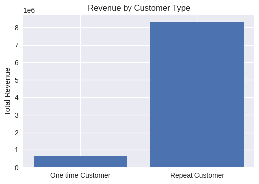
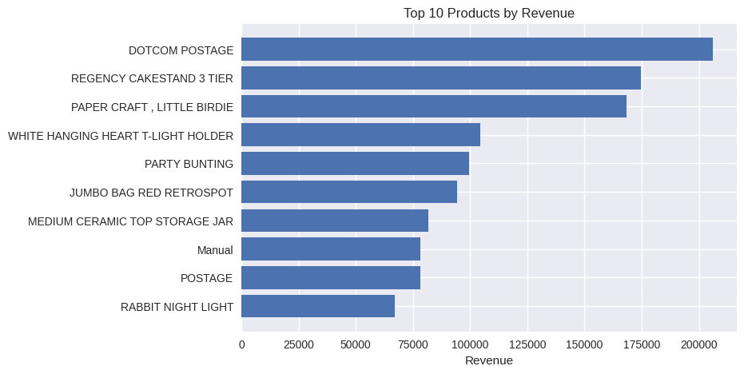

# Customer & Sales Insights Analysis

## Project Snapshot

**Business question:**  
How do customer behaviour, geography, and product performance drive revenue in an online retail business?

**Dataset:**  
Online Retail Transaction Data (UCI)

**Key outcomes:**
- Identified strong revenue concentration across a small number of countries.
- Revealed clear seasonal revenue patterns with year-end peaks.
- Found that repeat customers generate ~93% of total revenue.
- Highlighted that a small subset of products accounts for a large share of sales.

**Impact:**  
The analysis provides clear, data-driven direction for customer retention, inventory planning, and targeted growth strategies.

## Overview
This project analyses online retail transaction data to identify key sales trends,
customer behaviour patterns, and product performance insights.

The goal is to generate actionable, data-driven insights that support business
decision-making in marketing, customer retention, and inventory planning.

## Tools & Technologies
- Python (Pandas, NumPy, Matplotlib, Seaborn)
- Jupyter Notebook
- SQL (query examples)

## Key Insights
- Revenue is highly concentrated in a small number of countries.
- Clear seasonality exists, with strong peaks toward the end of the year.
- Repeat customers contribute a disproportionately large share of total revenue.
- A small subset of products drives a significant portion of overall sales.

## Business Value
The findings support:
- Targeted marketing and regional expansion strategies
- Improved customer retention through loyalty initiatives
- Better inventory and demand planning during peak seasons

## Key Visual Insights

### Revenue by Country (Top 10)


### Monthly Revenue Trend


### Revenue by Customer Type


### Top Products by Revenue



## Business Takeaways

- Sales revenue is highly concentrated in a small number of countries, suggesting opportunities for targeted geographic expansion and localisation strategies.
- Clear seasonality is observed, with revenue peaking toward the end of the year, highlighting the importance of holiday-driven promotions and inventory planning.
- Repeat customers generate the vast majority of total revenue, reinforcing the value of retention strategies such as loyalty programs and personalised offers.
- A limited set of products accounts for a disproportionate share of revenue, indicating opportunities to prioritise high-performing products in pricing, marketing, and supply chain decisions.

## How to Run This Project

1. Clone the repository
2. Install required Python libraries:
   ```bash
   pip install pandas numpy matplotlib seaborn

3. Open the Jupyter notebook:
notebooks/sales_insights_eda.ipynb

4. Run cells sequentially to reproduce the analysis and visualisations.

