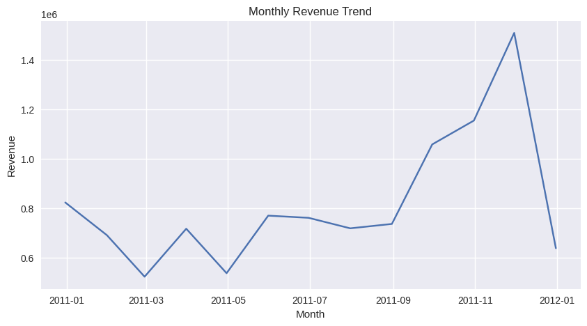
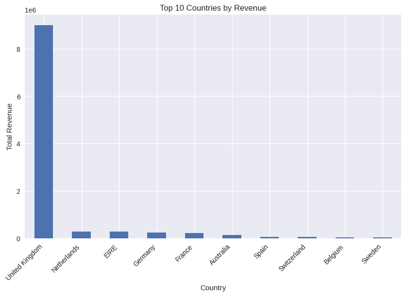
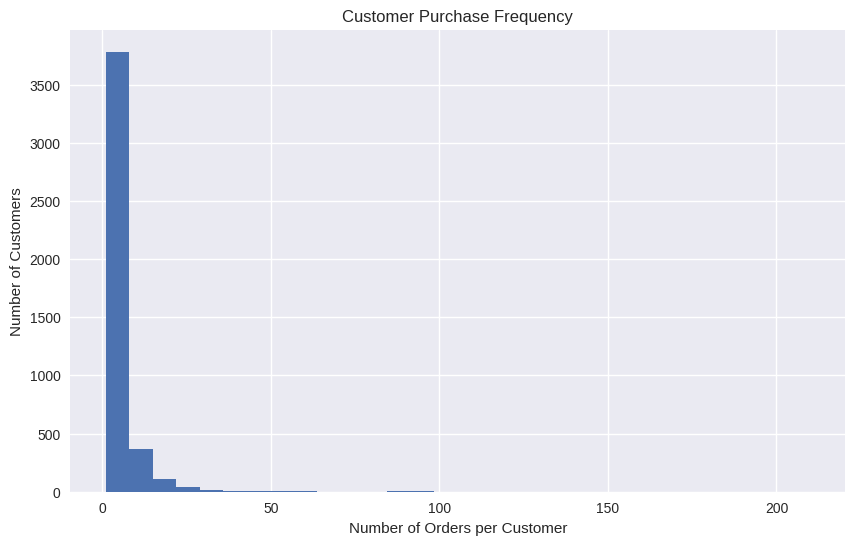

# 📊 Power BI Executive Dashboard

## Project Snapshot
An executive-level sales and customer insights dashboard designed to support
strategic decision-making, revenue optimisation, and customer retention.

---

## 🎯 Business Objectives
- Monitor overall revenue and growth trends
- Identify top-performing countries and products
- Compare repeat vs one-time customer contribution
- Support data-driven commercial and marketing decisions

## 🧩 Key Metrics
- Total Revenue
- Monthly Revenue Trend
- Revenue by Country
- Revenue by Customer Type
- Top Products by Revenue

## 🛠 Tools Used
- Power BI
- Power Query
- DAX (basic measures)
- Python (data preparation – see Project 01)

## 📈 Key Visual Insights

### 🔹 Revenue Trend (Monthly)


**Insight:** Clear seasonality with strong revenue peaks toward the end of the year,
indicating holiday-driven demand.

---

### 🌍 Revenue by Country


**Insight:** Revenue is highly concentrated in a small number of countries,
suggesting opportunities for targeted geographic expansion.

---

### 👥 Revenue by Customer Type


**Insight:** Repeat customers contribute the vast majority of total revenue,
highlighting the importance of retention strategies.

---

### 🛍️ Top Products by Revenue


**Insight:** A limited set of products accounts for a disproportionate share of revenue,
supporting prioritisation of high-performing items.

---

## 🧠 Business Value
- Supports executive-level decision-making
- Identifies revenue concentration risks
- Highlights retention and growth opportunities
- Enables data-driven marketing and inventory planning


## 🔍 Key Insights
- Revenue is highly concentrated in a small number of countries
- Clear seasonality with peaks toward year-end
- Repeat customers drive the majority of revenue
- A small set of products generates disproportionate sales

## 📌 Notes
This dashboard complements the exploratory analysis in **01_customer_sales_insights** and demonstrates how analytical insights are translated into executive-ready visuals.

## Business Impact

- Enabled executives to monitor revenue performance, customer behaviour, and product trends in one central dashboard.
- Improved visibility of repeat vs one-time customer contribution to total revenue.
- Supported data-driven decisions for marketing focus, inventory planning, and regional growth.

## Example DAX Measures

```DAX
Total Revenue = SUM(Sales[Revenue])

Repeat Customer Revenue =
CALCULATE(
    [Total Revenue],
    Sales[CustomerType] = "Repeat Customer"
)


