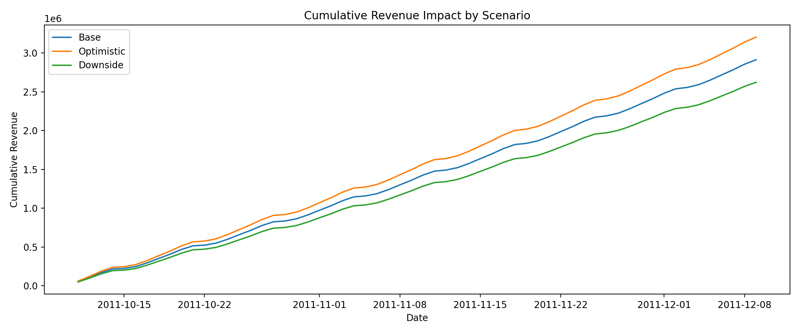

| Scenario-Based Forecasting (Bank-Style) | Python | Scenario analysis, forecasting, decision support | In progress | [Open](./04_scenario_based_forecasting/) |

# 📊 Scenario-Based Forecasting & Business Decision Support

## Project Overview
Financial institutions require forecasts that go beyond point estimates.  
This project demonstrates **scenario-based forecasting** to support strategic
planning, risk assessment, and decision-making under uncertainty.

The analysis is designed to reflect **banking and enterprise use cases**.

---

## Business Problem
Senior decision-makers need to understand:
- How revenue behaves under different economic scenarios
- The potential upside and downside risks
- The sensitivity of forecasts to key assumptions

This project addresses these needs using scenario-driven time series forecasting.

---

## Dataset
- Historical revenue time series
- Daily aggregation
- Used previously in baseline forecasting projects

---

## Methodology
1. **Baseline Forecast**
   - Best-performing time series model from prior analysis

2. **Scenario Design**
   - Optimistic scenario (growth acceleration)
   - Base case (trend continuation)
   - Pessimistic scenario (demand contraction / volatility)

3. **Scenario Forecasting**
   - Adjusted assumptions
   - Comparative forecast paths

4. **Business Interpretation**
   - Risk implications
   - Planning insights
   - Decision-support recommendations

---

## Key Insights
- Scenario ranges provide more value than single forecasts
- Downside risk can materially impact short-term planning
- Scenario-based forecasts improve financial resilience

---

## Tools & Skills
- Python
- Time Series Forecasting
- Scenario Analysis
- Business & Risk Interpretation
- Executive Communication

## Scenario Outputs

### Scenario Fan Chart

The fan chart visualises forecast uncertainty and supports stress testing by showing plausible revenue ranges under different demand assumptions.

### Cumulative Revenue Impact

Cumulative scenario trajectories quantify upside potential and downside risk over time, supporting financial planning and risk governance.

---

## Business Interpretation & Decision Impact

This scenario-based forecasting analysis supports revenue planning and risk management by quantifying uncertainty around expected outcomes.

Key takeaways:
- The **base scenario** represents expected cashflow under current demand patterns.
- The **optimistic scenario (+10%)** shows potential upside if demand accelerates, supporting growth planning.
- The **downside scenario (−10%)** highlights revenue-at-risk under adverse conditions.

Cumulative scenario analysis indicates a potential revenue gap of approximately **$300k–$500k** over the forecast horizon between optimistic and downside cases, enabling informed capital allocation, stress testing, and contingency planning.

## Project Status
🚧 In progress — scenario models and insights under development

