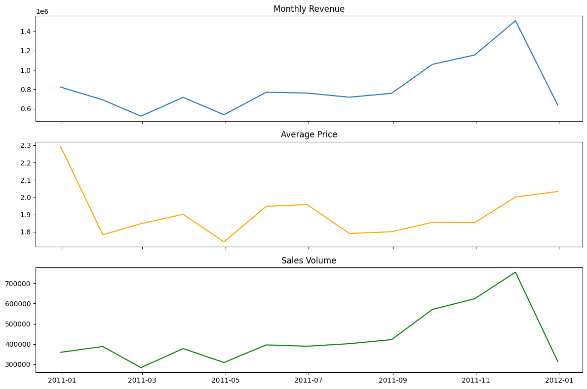

# 💳 Project 05 — Pricing / Revenue Optimisation Analytics (Price vs Volume)

## Overview
This project decomposes revenue movements into **price-driven** and **volume-driven** components to support pricing decisions, performance monitoring, and revenue planning—highly relevant for banking and commercial analytics.

## Business Questions
- Is revenue growth driven by **price** or **demand/volume**?
- What happens to revenue under **+5% / −5% price shocks**?
- What does an **elasticity proxy** suggest about pricing power?

## Dataset
Online retail transactions aggregated to monthly:
- Revenue = Quantity × UnitPrice  
- Monthly metrics: Revenue, Average Price, Sales Volume

## Method
1. Monthly aggregation
2. Revenue change decomposition:
   - Price effect = ΔPrice × prior Volume
   - Volume effect = ΔVolume × prior Price
3. Contribution (%) analysis
4. Price shock scenario (+5% / −5%)
5. Elasticity proxy (ΔlogQ vs ΔlogP)

## Key Insights

📊 Key Insights
1️⃣ Revenue Trends: Revenue, Price, and Volume Dynamics

This section provides an overview of monthly revenue, average price, and sales volume trends, highlighting how revenue performance evolves through the interaction of pricing and demand.

2️⃣ Revenue Decomposition: Price vs Volume Effects

This analysis decomposes monthly revenue changes into price-driven and volume-driven components.
It shows that volume changes dominate major revenue swings, while price effects explain short-term fluctuations.

![Revenue Decomposition] (images/revenue_decomposition.png)

https://github.com/susaanalytics/susa-analytics-portfolio/blob/main/05_pricing_revenue_optimisation/images/revenue_decomposition.png

3️⃣ Revenue Growth Contribution (%): Price vs Volume

This chart expresses price and volume contributions as percentages of total revenue change, highlighting periods where revenue growth was driven primarily by pricing versus demand shifts.

4️⃣Price Elasticity Proxy Analysis: %Δ Quantity vs %Δ Price

This scatter plot illustrates the relationship between percentage changes in price and percentage changes in quantity sold.  
It provides a proxy estimate of price elasticity and highlights asymmetric demand responses to pricing changes.

Key takeaways:
- Demand is generally price-sensitive but not uniformly elastic
- Price increases sometimes lead to sharp volume drops (pricing risk)
- Price decreases tend to generate more consistent volume uplift

  

5️⃣  Price Shock Scenario Analysis (±5%)

This scenario simulates the cumulative revenue impact of +5% and −5% price shocks, holding sales volume constant.
It demonstrates the asymmetric risk–return profile of pricing decisions, a critical concept in banking, risk analytics, and commercial strategy.
.png)

🧠 Business Interpretation

Revenue growth is primarily volume-driven in most periods, with pricing playing a secondary but sometimes amplifying role.

Price increases generate substantial cumulative gains, but also introduce downside risk if demand is price-sensitive.

The elasticity proxy suggests moderate price sensitivity, supporting cautious price optimisation rather than aggressive pricing.

Scenario-based stress testing provides a practical framework for risk-aware pricing and revenue planning, relevant to banking, finance, and commercial strategy roles.

## Tools
Python, Pandas, NumPy, Matplotlib, Statsmodels

## Outputs
- Price vs Volume contribution chart
- Price shock cumulative impact chart
- Elasticity proxy estimate + scatter plot
