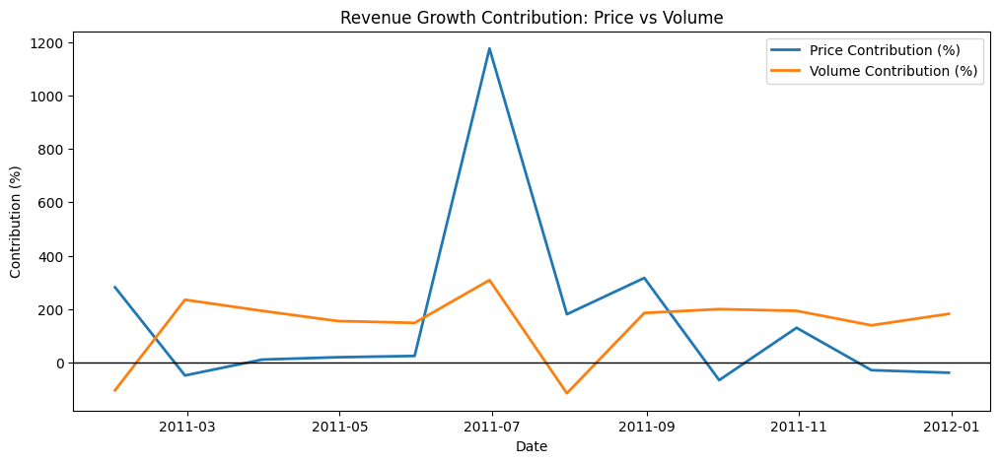

# 💳 Project 05 — Pricing / Revenue Optimisation Analytics (Price vs Volume)

## Overview
This project decomposes revenue movements into **price-driven** and **volume-driven** components to support pricing decisions, performance monitoring, and revenue planning—highly relevant for banking and commercial analytics.

## Business Questions
- Is revenue growth driven by **price** or **demand/volume**?
- What happens to revenue under **+5% / −5% price shocks**?
- What does an **elasticity proxy** suggest about pricing power?

## Dataset
Online retail transactions aggregated to monthly:
- Revenue = Quantity × UnitPrice  
- Monthly metrics: Revenue, Average Price, Sales Volume

## Method
1. Monthly aggregation
2. Revenue change decomposition:
   - Price effect = ΔPrice × prior Volume
   - Volume effect = ΔVolume × prior Price
3. Contribution (%) analysis
4. Price shock scenario (+5% / −5%)
5. Elasticity proxy (ΔlogQ vs ΔlogP)

## Key Insights

1️⃣ Revenue Decomposition: Price vs Volume

This analysis decomposes monthly revenue changes into price-driven and volume-driven components, helping identify the primary drivers of revenue growth and decline.

2️⃣ Revenue Growth Contribution (%)

This chart expresses the contribution of price and volume changes as percentages of total revenue change, highlighting periods where revenue movements were driven primarily by pricing decisions versus demand fluctuations.

3️⃣ Revenue Change Attribution (Price vs Volume)

A direct comparison of absolute revenue changes attributable to price and volume, supporting management decision-making around pricing strategy and demand management.

4️⃣ Price Shock Scenario Analysis (±5%)

This scenario simulates the cumulative revenue impact of +5% and −5% price shocks, holding sales volume constant.
It demonstrates the asymmetric risk and reward profile of pricing decisions — a key capability in banking, risk, and commercial analytics.

.png)

🧠 Business Interpretation

Revenue growth is primarily volume-driven in most periods, with pricing playing a secondary but sometimes amplifying role.

Price increases generate substantial cumulative gains, but also introduce downside risk if demand is price-sensitive.

The elasticity proxy suggests moderate price sensitivity, supporting cautious price optimisation rather than aggressive pricing.

Scenario-based stress testing provides a practical framework for risk-aware pricing and revenue planning, relevant to banking, finance, and commercial strategy roles.

## Tools
Python, Pandas, NumPy, Matplotlib, Statsmodels

## Outputs
- Price vs Volume contribution chart
- Price shock cumulative impact chart
- Elasticity proxy estimate + scatter plot
