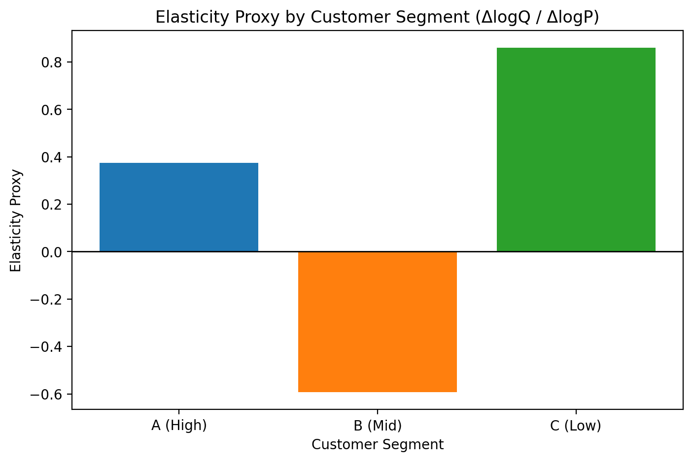

# Customer Price Elasticity by Segment

## Objective
Assess customer price sensitivity using transaction-level data to support
pricing strategy, revenue optimisation, and demand risk management.

## Methodology
- Customers segmented into Low, Mid, and High value groups based on total revenue
- Log–log regression estimating elasticity (ΔlogQ / ΔlogP)
- Segment-level comparison of price responsiveness

## Key Insights
- **High-value customers (A)** show low price sensitivity (elasticity ≈ +0.37),
  indicating pricing power with limited demand risk.
- **Mid-value customers (B)** are the most price-sensitive (elasticity ≈ −0.59),
  where price increases can materially reduce volume.
- **Low-value customers (C)** are highly volume-driven (elasticity ≈ +0.86),
  making competitive pricing and promotions more effective.

## Business Implications
- Enable differentiated pricing strategies by customer value
- Reduce downside risk from uniform price increases
- Support revenue stress testing and pricing governance

## Visual Summary

