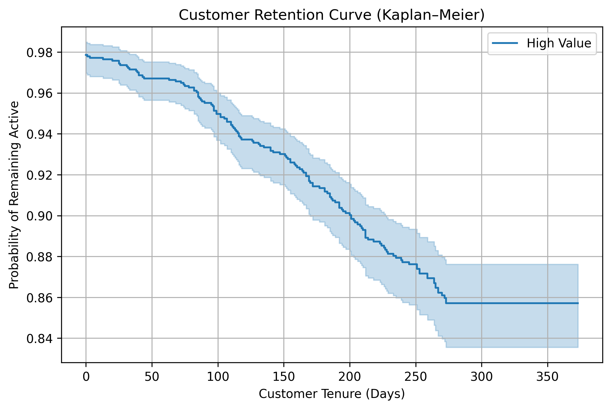
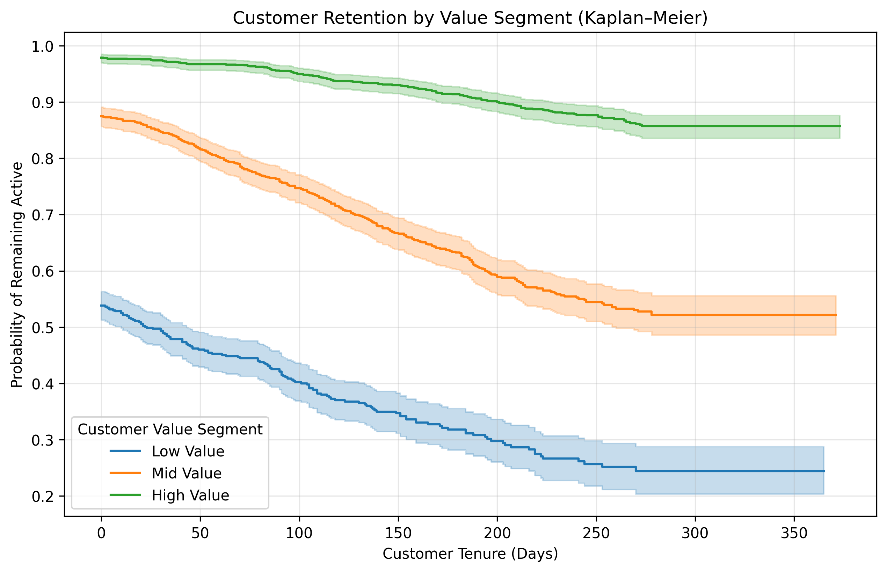

## Project 8 — Customer Risk & Retention Analytics (Survival / Churn-style)

### Overview
This project applies **survival analysis** to customer transaction history to quantify **retention (time-to-churn)** and identify the strongest drivers of churn risk. The analysis is designed to be **banking-relevant**, linking customer value segmentation to **revenue-at-risk** and producing interpretable risk signals for retention strategy.

### Business Questions
- How does customer retention decline over time (overall and by customer value tier)?
- Which customer behaviours are most associated with churn risk?
- Can we quantify “early warning” risk using inactivity and engagement signals?
- Which segments represent the highest **revenue-at-risk** exposure?

---

## Key Steps
1. **Customer-level feature engineering**
   - First purchase date, last purchase date
   - Tenure (days)
   - Inactive days (days since last purchase)
   - Customer value metrics (total revenue, total quantity, average price, invoice count)

2. **Churn definition**
   - A customer is labelled as churned if `inactive_days > 90` (threshold can be adjusted for business context).

3. **Kaplan–Meier retention curve**
   - Estimated overall retention probability over tenure.
   - Provides a baseline view of churn dynamics across the customer base.

4. **Retention by customer value segment (KM curves)**
   - Customers are segmented into **Low / Mid / High value** using revenue quantiles.
   - Multiple survival curves compare retention across segments on one chart.

5. **Revenue-at-risk summary**
   - Aggregated customers and total revenue exposure by value segment to identify where churn risk is financially concentrated.

6. **Cox Proportional Hazards (Cox PH) model**
   - Fitted a Cox PH model with interpretable covariates:
     - `log_inactive_days`, `log_n_invoices`, `log_total_revenue`, `log_total_qty`, `log_avg_price`
     - segment indicators (Low/Mid vs High baseline)
   - Produced adjusted survival curves and a coefficient plot (log(HR) with 95% CI).

7. **Model diagnostics**
   - Schoenfeld residual checks show **time-varying effect** for inactivity, indicating churn risk from inactivity intensifies with tenure.

---

## Key Insights (Executive / Banking-Style)
- **Retention is strongly stratified by customer value tier**: High-value customers retain materially better than Mid- and Low-value customers even after adjustment.
- **Behavioural disengagement dominates churn risk**: inactivity is a major risk driver, while purchase frequency significantly reduces hazard.
- **Inactivity is time-varying**: diagnostics suggest the impact of inactivity increases over time, supporting **tenure-aware early warning triggers** rather than static rules.
- This framework supports **revenue-at-risk prioritisation** and targeted retention strategies by segment.

---

## Visual Outputs

### 1) Retention curve (Kaplan–Meier)

### 2) Retention by value segment (Kaplan–Meier)

### 3) Adjusted survival curves (Cox PH)

### 4) Cox PH coefficients (log-hazard ratios) with 95% CI

### 5) Schoenfeld residual diagnostics (PH assumption)

---

## Outputs
- Customer churn labels + tenure metrics
- Segment-level retention curves
- Cox PH model results (hazard ratios + adjusted survival curves)
- Revenue-at-risk summary by segment

---

## Notes / Limitations
- The churn threshold (90 inactive days) is a business assumption and should be calibrated to the industry/product context.
- Schoenfeld diagnostics suggest **non-proportional hazards** for inactivity; next step is a **time-varying Cox** formulation (or discrete-time hazard model).

---

## Next Enhancements (Optional)
- Time-varying Cox model for inactivity effects
- Revenue-at-risk forecasting using hazard × customer value
- Segment-specific churn triggers and intervention prioritisation

